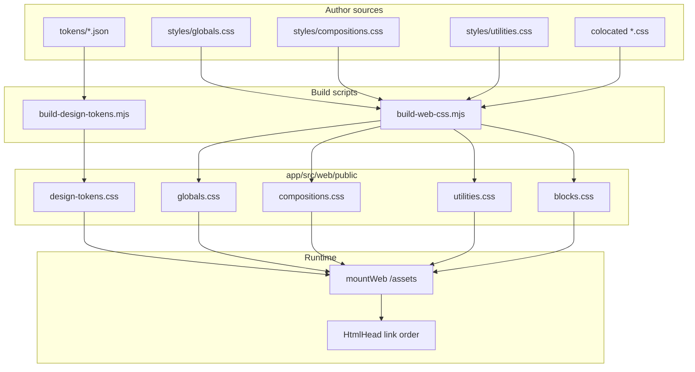

# Web CSS build (CUBE + tokens)

## End-to-end layout

- **Compile output:** `pnpm run build` runs **`build:tokens`** then **`build:css`** then **`build:client-js`**, then `tsc`, `vendor-htmx`, `transfer-web`. Static files under `src/web/public/` are copied to **`dist/web/public/`** for production.
- **Dev:** `nodemon` watches `src` (including **`css`** and token **`json`**). Generated files in `public/*.css` and **`public/routes/**`** (copied `*.client.js`) are **ignored** in `nodemon.json` so rebuilds do not loop.
- **Serving:** [`mountWeb`](app/src/web/mountWeb.ts) mounts **`express.static`** at **`/assets`** → `path.join(__dirname, "public")` (i.e. `dist/web/public` when running compiled output). [`HtmlHead`](app/src/web/shared/components/html-head/html-head.tsx) uses root-absolute URLs: **`/assets/<file>.css`**.
- **API vs static:** [`mountJsonApi`](app/src/api/mountJsonApi.ts) is mounted at **`/api`** only, so JSON auth middleware never runs for **`/assets/*`** or HTML routes.

## CUBE CSS in ndb2

**CUBE** = **C**omposition, **U**tility, **B**lock, **E**xception ([cube.fyi](https://cube.fyi/), [piccalil.li writeup](https://piccalil.li/blog/cube-css/)). In this repo, layers map to files like this:

| CUBE idea | ndb2 delivery | Author |
|-----------|----------------|--------|
| **CSS baseline** + token variables | `design-tokens.css` + `globals.css` | Tokens: `app/src/web/tokens/*.json`; globals: `app/src/web/styles/globals.css` |
| **Composition** | `compositions.css` | `app/src/web/styles/compositions.css` |
| **Utility** | `utilities.css` | `app/src/web/styles/utilities.css` |
| **Block** + **Exception** | `blocks.css` | Colocated `*.css` next to components (variants/states via `data-*` in selectors) |

**Markup convention:** group classes in order: **compositions** → **utilities** → **blocks** → **exceptions** (see **`cube-css-authoring`**, *Class order in markup*). **Do not** add new BEM-style **`app-shell__grid`** / **`block__element`** class families for layout—use one **block** root + **composition** classes + nested **`&`** rules; **`app-shell__*`** in **`page-layout`** is legacy (see **`cube-css-authoring`**, *Nesting child and element rules*).

**Checklist for new UI:** Prefer globals → compositions → utilities; add colocated block CSS only when necessary; use **`data-variant`**, **`data-size`**, **`data-state`** (or `aria-*`) for exceptions; avoid new **`__`**-chain block names unless **`cube-css-authoring`**’s rare-exception criteria apply.

Full methodology and roadmap: [`docs/frontend/cube-css.md`](docs/frontend/cube-css.md). Token values: [`docs/frontend/design.md`](docs/frontend/design.md). Responsive **`@media`** cut points: **`web-breakpoints`**.

## `<head>` stylesheet order

In [`html-head/html-head.tsx`](app/src/web/shared/components/html-head/html-head.tsx) (component **`HtmlHead`**; after meta/title):

1. `design-tokens.css` — custom properties
2. `globals.css` — resets / element defaults (use `var(--…)`)
3. `compositions.css` — layout primitives
4. `utilities.css` — token-backed helpers
5. `blocks.css` — concatenated block + exception rules

Then HTMX (`htmx.min.js`).

## Design tokens (`build-design-tokens.mjs`)

| Piece | Location |
|-------|----------|
| Token sources | `app/src/web/tokens/*.json` (arrays; schema under `tokens/schema/`) |
| Generator | `app/scripts/build-design-tokens.mjs` |
| Output | `app/src/web/public/design-tokens.css` (do not edit by hand) |

**pnpm:** `build:tokens` — also chained from `build` / `postinstall`.

**Token item:** `name` (string), `value` (string), optional `description`. If `value` equals another token’s `name`, CSS emits **`var(--dotted-name-as-kebab)`**.

**Name → variable:** `brand.500` → `--brand-500`; `text.2xl` → `--text-2xl`; `breakpoint.desktop` → `--breakpoint-desktop` (see **`breakpoints.json`**, **`web-breakpoints`**). Breakpoint vars are for **properties**, not **`@media`** conditions — use matching **`rem`** literals in media queries.

**`colors.json`:** `brand.*`, `neutral.*`, per-scheme `scheme.*`, `color.semantic.*` → `--color-*`; `color.light.*` / `color.dark.*` → shared alias names in `:root` vs `html[data-theme="dark"]` (light/dark **pairs must match**). `html[data-color-scheme="…"]` remaps `--brand-*` and `--neutral-*` to the chosen **accent palette**; cookie **`ndb2_color_scheme`**, default **neptune**. **Why and how the product uses themes / palettes (feel, light vs dark, named schemes):** **`ndb2-web-design`**. **Implementation:** `data-theme` `light` | `dark` | `system`; cookie **`ndb2_theme`**; absent = **system** with `@media (prefers-color-scheme: dark)` for `html[data-theme="system"]`. **`build-client-js`** + `themePreferenceMiddleware` (rolling `Set-Cookie`): `app/src/web/middleware/theme-preference.ts`, `routes/home/page.client.js`.

**`TOKEN_FILES` order** in the script controls declaration order inside `:root`. **`meta.json`** is not part of token CSS unless added to `TOKEN_FILES`.

**Extend literals:** update **`isValidTokenValue`** in `build-design-tokens.mjs` if new CSS value shapes are needed.

## CUBE layers + blocks (`build-web-css.mjs`)

| Piece | Location |
|-------|----------|
| Layer sources | `app/src/web/styles/globals.css`, `compositions.css`, `utilities.css` |
| Block sources | Any `*.css` under `app/src/web/` **except** `public/`, `tokens/`, `styles/` |
| Generator | `app/scripts/build-web-css.mjs` |
| Outputs | Copies of the three layer files + **`blocks.css`** (concatenated, `/* ndb2:block: path */` banners) |

**pnpm:** `build:css` — also chained from `build` / `postinstall`.

**Block bundle order:** Lexicographic sort of file paths. Add block CSS beside `*.tsx`; run `build:css` or `build`; do not hand-edit `public/blocks.css`.

**Authoring style:** Layer and block sources may use **native CSS nesting** (`&` for pseudo-states, **and** for child/element rules under a single block root so related selectors are not split across many top-level stanzas). The script **copies** `globals.css` / `compositions.css` / `utilities.css` **verbatim** and **concatenates** block files without transforming CSS. See **`cube-css-authoring`**: **Nesting states in the parent**, **Nesting child and element rules under the block root**, and **Sectioning a block file**.

## Route colocated client JS

See **`web-client-js`** for colocation, `build-client-js.mjs`, generated **`routeClientScripts.ts`**, **`/assets/routes/...`**, and **`HtmlHead`** wiring.

## Changing the pipeline

- **New token file:** add JSON under `tokens/`, append filename to **`TOKEN_FILES`** in `build-design-tokens.mjs`, rebuild.
- **New palette prefix:** extend color primitive detection in `build-design-tokens.mjs` (or refactor to a prefix list).
- **New theme key:** add matching `color.light.<X>` and `color.dark.<X>` in `colors.json`.
- **Dark selector:** change `html[data-theme="dark"]` in `build-design-tokens.mjs`; update tests if needed.
- **New layer file:** uncommon; would require editing `build-web-css.mjs` and `html-head.tsx` (`HtmlHead`).
- **New route client script:** add `*.client.js` under `routes/<area>/`, run **`build:client-js`**; `page.tsx` already uses **`clientScriptsForModule(__filename)`** so no key edit is needed.
- **Asset URL base:** if the app is ever served under a subpath, root-absolute `/assets/...` links may need a configurable prefix (not implemented today).

## Related

- **ndb2-web-design** — look and feel, space-palette naming, light/dark vs colour-scheme behaviour, semantic `var(--color-*)` (not UX or a11y policy).
- **cube-css-authoring** — where to put new CSS (globals vs compositions vs utilities vs blocks) when building pages/components.
- **kitajs-html-web** — `page.tsx`, `handler.tsx`, [`HtmlHead`](app/src/web/shared/components/html-head/html-head.tsx), HTMX.
- **web-client-js** — route colocated `*.client.js`, `build:client-js`, static script URLs.
- **express-route-map** — web `Route` modules.

This skill supersedes the old **`design-tokens-build`** skill (removed); scope now covers the full CSS pipeline, not only tokens.
