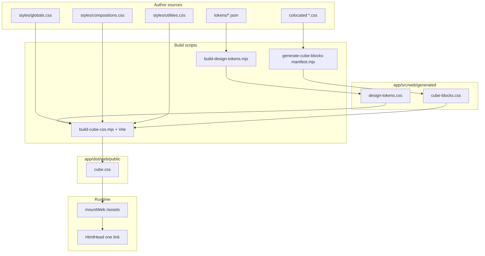

# Web CSS build (CUBE + tokens)

## End-to-end layout

- **Compile output:** `pnpm run build` runs **`build:web-assets`** (Wireit: **`vendor-htmx`**, **`build:tokens`**, **`build:css`**, **`build:client-js`**, then copy **`src/web/public`**) then `tsc`, `tsc-alias`, `transfer-queries`. **`build:css`** emits **`dist/web/public/cube.css`**; hand-placed static (fonts, etc.) in **`app/src/web/public/`** is merged by **`build:web-assets`**.
- **Dev:** **`tsx watch`** + Vite middleware. **`HtmlHead`** uses **`cubeStylesheetHref()`**: **`/src/web/styles/cube-entry.css`** (Vite **CSS HMR**). **`vite-dev-asset-watch`** (Vite plugin) on token JSON runs **`build:tokens`** + **`build:web-assets`**; on other CSS it runs **`generate-cube-blocks-manifest.mjs`** + **`build:web-assets`** (watchers ignore **`src/web/generated/**`** so manifest writes do not loop). Client **`*.client.*`** still runs **`build:client-js`** and touches **`index.ts`**.
- **Serving:** [`mountWeb`](app/src/web/mountWeb.ts) uses sentinel **`cube.css`** under **`dist/web/public/`**. [`HtmlHead`](app/src/web/shared/components/html-head/html-head.tsx) links **`/assets/cube.css`** in production.
- **API vs static:** [`mountJsonApi`](app/src/api/mountJsonApi.ts) is mounted at **`/api`** only, so JSON auth middleware never runs for **`/assets/*`** or HTML routes.

## CUBE CSS in ndb2

**CUBE** = **C**omposition, **U**tility, **B**lock, **E**xception ([cube.fyi](https://cube.fyi/), [piccalil.li writeup](https://piccalil.li/blog/cube-css/)). In this repo, layers map to files like this:

| CUBE idea | ndb2 delivery | Author |
|-----------|----------------|--------|
| **CSS baseline** + token variables | First segments of **`cube.css`** | Tokens: `app/src/web/tokens/*.json` → **`generated/design-tokens.css`**; globals: **`styles/globals.css`** |
| **Composition** | (bundled in **`cube.css`**) | `app/src/web/styles/compositions.css` |
| **Utility** | (bundled in **`cube.css`**) | `app/src/web/styles/utilities.css` |
| **Block** + **Exception** | (bundled in **`cube.css`**) | Colocated `*.css` via **`generated/cube-blocks.css`** `@import` list (sorted paths) |

**Markup convention:** group classes in order: **compositions** → **utilities** → **blocks** → **exceptions** (see **`cube-css-authoring`**, *Class order in markup*). **Do not** add new BEM-style **`app-shell__grid`** / **`block__element`** class families for layout—use one **block** root + **composition** classes + nested **`&`** rules; **`app-shell__*`** in **`page-layout`** is legacy (see **`cube-css-authoring`**, *Nesting child and element rules*).

**Checklist for new UI:** Prefer globals → compositions → utilities; add colocated block CSS only when necessary; use **`data-variant`**, **`data-size`**, **`data-state`** (or `aria-*`) for exceptions; avoid new **`__`**-chain block names unless **`cube-css-authoring`**’s rare-exception criteria apply.

Full methodology and roadmap: [`docs/frontend/cube-css.md`](docs/frontend/cube-css.md). Token values: [`docs/frontend/design.md`](docs/frontend/design.md). Responsive **`@media`** cut points: **`web-breakpoints`**.

## `<head>` stylesheet

In [`html-head/html-head.tsx`](app/src/web/shared/components/html-head/html-head.tsx) (**`HtmlHead`**): one **`<link rel="stylesheet" href={cubeStylesheetHref()} />`** — dev **`/src/web/styles/cube-entry.css`**, prod **`/assets/cube.css`**. Cascade inside the bundle matches: tokens → globals → compositions → utilities → blocks (see **`styles/cube-entry.css`**). Then HTMX (`htmx.min.js`).

## Design tokens (`build-design-tokens.mjs`)

| Piece | Location |
|-------|----------|
| Token sources | `app/src/web/tokens/*.json` (arrays; schema under `tokens/schema/`) |
| Generator | `app/scripts/build-design-tokens.mjs` |
| Output | `app/src/web/generated/design-tokens.css` (do not edit by hand) |

**pnpm:** `build:tokens` — also chained from `build` / `postinstall`.

**Token item:** `name` (string), `value` (string), optional `description`. If `value` equals another token’s `name`, CSS emits **`var(--dotted-name-as-kebab)`**.

**Name → variable:** `brand.500` → `--brand-500`; `text.2xl` → `--text-2xl`; `breakpoint.desktop` → `--breakpoint-desktop` (see **`breakpoints.json`**, **`web-breakpoints`**). Breakpoint vars are for **properties**, not **`@media`** conditions — use matching **`rem`** literals in media queries.

**`colors.json`:** `brand.*`, `neutral.*`, per-scheme `scheme.*`, `color.semantic.*` → `--color-*`; `color.light.*` / `color.dark.*` → shared alias names in `:root` vs `html[data-theme="dark"]` (light/dark **pairs must match**). `html[data-color-scheme="…"]` remaps `--brand-*` and `--neutral-*` to the chosen **accent palette**; cookie **`ndb2_color_scheme`**, default **neptune**. **Why and how the product uses themes / palettes (feel, light vs dark, named schemes):** **`ndb2-web-design`**. **Implementation:** `data-theme` `light` | `dark` | `system`; cookie **`ndb2_theme`**; absent = **system** with `@media (prefers-color-scheme: dark)` for `html[data-theme="system"]`. **`build-client-js`** + `themePreferenceMiddleware` (rolling `Set-Cookie`): `app/src/web/middleware/theme-preference.ts`, `routes/home/page.client.js`.

**`TOKEN_FILES` order** in the script controls declaration order inside `:root`. **`meta.json`** is not part of token CSS unless added to `TOKEN_FILES`.

**Extend literals:** update **`isValidTokenValue`** in `build-design-tokens.mjs` if new CSS value shapes are needed.

## CUBE bundle (`build-cube-css.mjs` + Vite)

| Piece | Location |
|-------|----------|
| Entry (author) | `app/src/web/styles/cube-entry.css` imports tokens, three layers, **`generated/cube-blocks.css`** |
| Vite entry (build) | `app/src/web/styles/cube-bundle.ts` — `import "./cube-entry.css"` (prod Rollup only) |
| Block manifest | `app/scripts/generate-cube-blocks-manifest.mjs` → **`src/web/generated/cube-blocks.css`** (`@import` per block, `/* ndb2:block: path */`) |
| Prod bundle | `app/scripts/build-cube-css.mjs` — manifest + **`vite build`** → **`dist/web/public/cube.css`** |
| Layer sources | `app/src/web/styles/globals.css`, `compositions.css`, `utilities.css` |
| Block sources | Any `*.css` under `app/src/web/` **except** `public/`, `tokens/`, `styles/`, **`generated/`** |

**pnpm:** `build:css` — also chained from `build` / `postinstall`.

**Block order:** Same as before: lexicographic sort of paths. Do not hand-edit **`cube-blocks.css`**; run **`pnpm run build:css`** or **`generate-cube-blocks-manifest.mjs`**.

**Authoring style:** Vite bundles CSS with PostCSS defaults; sources still use **native nesting** as in **`cube-css-authoring`**.

## Route colocated client JS

See **`web-client-js`** for colocation, `build-client-js.mjs`, generated **`routeClientScripts.ts`**, **`/assets/routes/...`**, and **`HtmlHead`** wiring.

## Changing the pipeline

- **New token file:** add JSON under `tokens/`, append filename to **`TOKEN_FILES`** in `build-design-tokens.mjs`, rebuild.
- **New palette prefix:** extend color primitive detection in `build-design-tokens.mjs` (or refactor to a prefix list).
- **New theme key:** add matching `color.light.<X>` and `color.dark.<X>` in `colors.json`.
- **Dark selector:** change `html[data-theme="dark"]` in `build-design-tokens.mjs`; update tests if needed.
- **New layer file:** uncommon; add `@import` in **`styles/cube-entry.css`** and a source under **`styles/`**.
- **New route client script:** add `*.client.js` under `routes/<area>/`, run **`build:client-js`**; `page.tsx` already uses **`clientScriptsForModule(__filename)`** so no key edit is needed.
- **Asset URL base:** if the app is ever served under a subpath, root-absolute `/assets/...` links may need a configurable prefix (not implemented today).

## Related

- **ndb2-web-design** — look and feel, space-palette naming, light/dark vs colour-scheme behaviour, semantic `var(--color-*)` (not UX or a11y policy).
- **cube-css-authoring** — where to put new CSS (globals vs compositions vs utilities vs blocks) when building pages/components.
- **kitajs-html-web** — `page.tsx`, `handler.tsx`, [`HtmlHead`](app/src/web/shared/components/html-head/html-head.tsx), HTMX.
- **web-client-js** — route colocated `*.client.js`, `build:client-js`, static script URLs.
- **express-route-map** — web `Route` modules.

This skill supersedes the old **`design-tokens-build`** skill (removed); scope now covers the full CSS pipeline, not only tokens.
